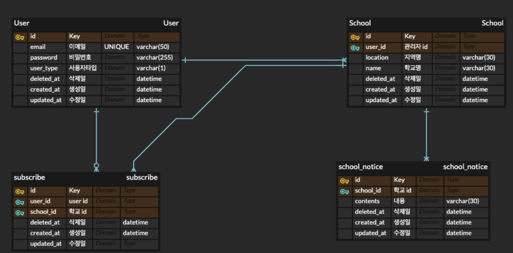

# School Feed

간단한 학교 구독 API 입니다.

- 학교 관리자는 학교 페이지를 만들고 소식을 공유합니다
- 학생 유저는 학교를 구독하고, 소식들을 조회합니다.
- soft delete를 적용하였습니다.

# Stacks & Requirements

- stacks & library:
  Nest.js, MySQL8.0, TypeORM, Swagger, Node.js(`^16.18.1`)
- requirements
  ```
  "mysql2": "^2.3.3",
  "@nestjs/common": "^9.0.0",
  "@nestjs/config": "^2.2.0",
  "@nestjs/core": "^9.0.0",
  "@nestjs/jwt": "^9.0.0",
  "@nestjs/mapped-types": "*",
  "@nestjs/passport": "^9.0.0",
  "@nestjs/platform-express": "^9.0.0",
  "@nestjs/swagger": "^6.1.4",
  "@nestjs/typeorm": "^9.0.1",
  "class-transformer": "^0.5.1",
  "class-validator": "^0.13.2",
  ```

# Install and config

- install

패키지 관리자는 npm을 사용하였습니다.

```bash
git clone https://github.com/yomapi/school_feed.git
cd school_feed
npm install
```

- Config

```jsx
// ./env/.exmaple.env
DB_HOST=your db_host_address_here
DB_PORT=3306
DB_USER_NAME=user_name
DB_PASSWORD=db_password_here
DB_NAME=database_name_here
JWT_SECRET=SOME_SECRET
```

- run server

```bash
npm run start:dev
```

# Database



# **Features**

- 유저
  - 회원가입
  - 로그인
- 학교 관리자 **(관리자 전용 기능)**
  - 지역, 학교명으로 학교 생성 가능
  - 학교 페이지 공지사항 생성, 수정, 삭제 기능
- 구독
  - 학교 구독, 구독취소 기능
  - 구독한 학교 목록 조회 (Pagination)
  - 학교 페이지 별, 공지사항 조회 기능 (Pagination)

# API DOCS

<aside>
💡 본 프로젝트는 Swagger를 이용하고 있습니다.
서버 실행 후, `{root_url}/docs` 에서 확인 할 수 있습니다.
또는, http://3.39.40.203/docs 를 눌러 확인해보세요.
</aside>
